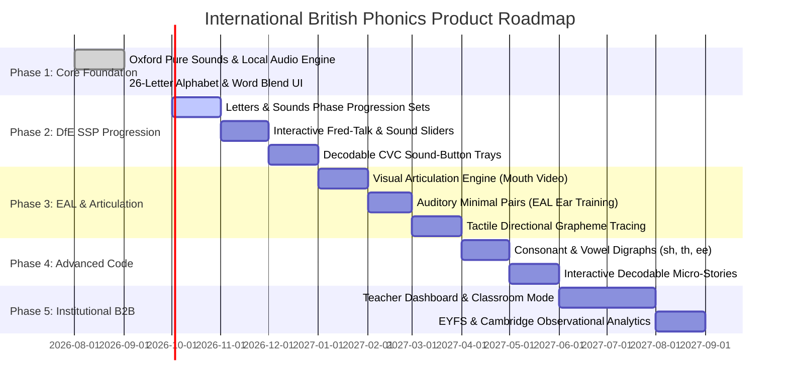

# 🇬🇧 International British Phonics Platform: Strategic Product Roadmap
**Document Version:** 2.0.0  
**Author:** Senior Product Manager (Early Literacy & EdTech)  
**Pedagogical Advisory:** UK DfE Systematic Synthetic Phonics (SSP) Standards & International British Schools (COBIS / CIS / Cambridge Early Years)  
**Target Audience:** Engineering, Design, Pedagogical Advisory Board, School Auditors, Investors  

---

## Executive Summary

Most early childhood literacy applications in the global market suffer from two critical pedagogical flaws:
1. **Accent and Phoneme Mismatch:** They default to General American (GenAm) phonetic models, with pervasive **schwa addition** (e.g. pronouncing /b/ as *"buh"*, /p/ as *"puh"*, /t/ as *"tuh"*), which actively impedes early decoding and synthetic blending.
2. **Pedagogical Incoherence:** They present letters in arbitrary alphabetical order (A–Z) rather than the research-backed **Systematic Synthetic Phonics (SSP)** progression, overwhelming toddlers with visual symbols before auditory discrimination is established.

This roadmap establishes the pathway for transforming our React/TypeScript Web & Mobile application into the **gold-standard International British Phonics platform**. Designed for both at-home preschool exploration (ages 2–4) and formal institutional adoption across British International Schools, bilingual kindergartens, and Cambridge Early Years centers across 160+ countries.

---

## 1. Pedagogical Pillars & International Accreditation Standards

Our platform is engineered against four authoritative educational benchmarks:

```
┌────────────────────────────────────────────────────────────────────────────┐
│                    INTERNATIONAL PEDAGOGICAL PILLARS                       │
├─────────────────────────────────────┬──────────────────────────────────────┤
│ 1. UK DfE SSP Validation Framework │ 2. EYFS Statutory Framework          │
│    • Pure sounds (zero schwa)       │    • Communication & Language focus   │
│    • Grapheme-Phoneme Correspondences│   • Physical development (fine motor)│
│    • Systematic decodable blending  │    • Low overstimulation / sensory calm│
├─────────────────────────────────────┼──────────────────────────────────────┤
│ 3. Cambridge Early Years & IB-PYP   │ 4. EAL / International Discrimination │
│    • Inquiry-led playful discovery  │    • Articulatory visual cues (mouth)│
│    • Dual-track home/school bridge  │    • Minimal pair audio training      │
│    • Universal non-text affordances │    • Multilingual parent scaffolding │
└─────────────────────────────────────┴──────────────────────────────────────┘
```

### Key Pedagogical Principles Dictated by British Phonics Auditors:
1. **Continuous Voicing vs. Crisp Stop Plosives:**
   - *Continuous Consonants* (/m/, /s/, /f/, /l/, /r/, /n/, /v/, /z/): Taught as sustained sounds without clipping or vowel attachments.
   - *Unvoiced Plosives* (/p/, /t/, /k/): Kept completely whisper-crisp to ensure toddlers do not blend *"p-a-t"* into *"puh-a-tuh"*.
2. **Systematic GPC Ordering (Phase 2):**
   - The conventional A–Z alphabet grid is replaced with the internationally recognized high-yield decodable sound sets (**Set 1: s, a, t, p**; **Set 2: i, n, m, d**; etc.), unlocking word blending (*sat, pat, tap, pin*) in week 2 rather than month 6.
3. **Multi-Sensory VAKT (Visual, Auditory, Kinesthetic, Tactile):**
   - See the mouth shape $\rightarrow$ Hear the authentic Oxford phoneme $\rightarrow$ Trace with directional tactile glow $\rightarrow$ Blend with physical finger sliders.

---

## 2. Multi-Phase Roadmap (2026 – 2027)



---

### Phase 1: Pure Sound Foundation & Offline Architecture (Completed ✅)
* **Deliverables:**
  - Complete 47-sound authentic human Oxford Dictionary pronunciation dataset bundled locally in `public/audio/`.
  - 84 slow British English curriculum word assets generated with calm toddler pacing (`speed: 0.70`).
  - Zero-latency local audio engine eliminating browser `SpeechSynthesis` drops and CORS/Cloudinary blockers.
  - Responsive 26-Letter Explorer with in-place sound buttons + British Sounds chart (Consonants, Vowels, Diphthongs).
  - Toddler-tested tactile UX: $\ge$ 88px buttons, zero failure screens, squash-and-stretch micro-animations.

---

### Phase 2: Systematic Synthetic Phonics (SSP) Progression & Blending (Q4 2026)
*Target: Ages 2.5 – 4.0 | Alignment: DfE Letters & Sounds Phase 2, Jolly Phonics Sets 1–7*

1. **Curriculum Re-Sequencing: From Alphabet to Decodable Sets**
   - Transition navigation from A–Z grid to pedagogical Sound Sets:
     - **Set 1:** `s, a, t, p` $\rightarrow$ Immediate word building: *at, sat, pat, tap*.
     - **Set 2:** `i, n, m, d` $\rightarrow$ Unlocks: *it, in, pan, pin, tin, tan, dad, sad*.
     - **Set 3:** `g, o, c, k` $\rightarrow$ Unlocks: *cat, cot, dog, kid, kit, pick*.
     - **Set 4:** `ck, e, u, r` $\rightarrow$ Unlocks: *red, run, mug, duck, rock*.
     - **Set 5:** `h, b, f, l` $\rightarrow$ Unlocks: *hat, bag, fun, lip, bell*.
     - **Set 6:** `j, v, w, x` $\rightarrow$ Unlocks: *jam, vet, win, box*.
     - **Set 7:** `y, z, qu` $\rightarrow$ Unlocks: *yes, zip, quiz*.
   - Mode Toggle: Parents and teachers can toggle between **"Alphabet Explorer"** and **"Systematic Phonics Sets"**.

2. **The "Sound Slider" & Tactile Sound Buttons (Oral Blending Engine)**
   - Under each word, display official DfE **Sound Buttons** (dots for single phonemes, lines for digraphs).
   - Toddlers press buttons individually: `/s/` [tap] $\rightarrow$ `/æ/` [tap] $\rightarrow$ `/t/` [tap].
   - Swipe the "Sound Slider" left-to-right to trigger smooth continuous blending: *"/s/ - /æ/ - /t/ ... SAT!"* accompanied by delightful visual fusion animation.

3. **Segmenting Trays (Elkonin Sound Boxes)**
   - Tactile auditory drag-and-drop: Child hears *"Sun"* and pulls 3 sound tokens into 3 wooden trays.

---

### Phase 3: Visual Articulation & International EAL Multi-Sensory Engine (Q1 2027)
*Target: International Schools, Bilingual Learners, Speech & Language Therapists*

1. **Articulatory Video / Anatomical Cross-Section Visuals**
   - Feedback from international British school teachers in Dubai, Singapore, Madrid, and Tokyo highlighted: *non-native speakers cannot distinguish /b/ and /v/, /p/ and /f/, or /θ/ (three) and /s/ (see) without seeing mouth mechanics*.
   - **Milo’s Articulation Studio**: High-frame-rate, warm illustrative close-ups showing:
     - Lip position (rounded, unrounded, pressed).
     - Tongue placement against teeth or alveolar ridge.
     - Throat vibration indicator (Voiced 🟢 vs. Unvoiced ⚪).

2. **Auditory Minimal Pairs Trainer ("Train Your Ear")**
   - Mini-game designed specifically for international EAL toddlers:
     - Distinguish confusing pairs: `/b/` vs `/v/` (*bat* vs *vat*), `/p/` vs `/b/` (*pat* vs *bat*), `/l/` vs `/r/` (*lip* vs *rip*).
   - Visual rewards with zero negative reinforcement (if the toddler taps the wrong sound, the sound simply replays gently without buzzer or failure sounds).

3. **Directional Tactile Letter Formation (Pre-Writing Kinesthetics)**
   - Toddlers trace the letter using a finger following a sparkling firefly trail.
   - Strictly enforces British cursive/print starting points (e.g. starting at top for *t*, anti-clockwise for *c*, *a*, *d*, *g*).

---

### Phase 4: Digraphs, Diphthongs & Advanced Decodable Stories (Q2 2027)
*Target: Ages 4 – 5.5 | Alignment: DfE Letters & Sounds Phase 3 & 4*

1. **Consonant & Vowel Digraph Modules ("Special Friends")**
   - Two letters, one sound:
     - Consonant Digraphs: `ch` (chip), `sh` (ship), `th` (thin / this), `ng` (ring), `nk` (sink).
     - Vowel Digraphs: `ai` (rain), `ee` (feet), `igh` (night), `oa` (boat), `oo` (moon / book), `ar` (car), `or` (fork), `ur` (burn), `ow` (now), `oi` (coin).
   - Interactive pair animations showing the two letters holding hands to make a single unified sound.

2. **Decodable Micro-Readers (100% Phonics-Controlled)**
   - Interactive 3-page toddler picture books where **every single word** is constructed exclusively from previously unlocked phonemes plus 5 foundational "Tricky Words" (*the, to, I, no, go*).
   - Tap any word in the sentence to trigger individual phoneme breakdown followed by sentence playback in natural British RP.

---

### Phase 5: Institutional B2B, Teacher Portal & International School Auditing (Q3 2027)
*Target: Nursery & Reception Classrooms, British Council, COBIS Schools*

1. **Interactive Whiteboard / Classroom Multi-Touch Mode**
   - Support for 65"+ Clevertouch / Promethean interactive panels used in British international classrooms.
   - Multi-user simultaneous touch: up to 4 toddlers can explore sounds simultaneously on carpet time.

2. **Educator Analytics & EYFS Progress Mapping**
   - Generates observational reports directly mapped to:
     - **EYFS Profile:** *Communication and Language* (Listening, Attention & Understanding; Speaking).
     - **Phonics Screening Check (Year 1 readiness)**: Real-time identification of weak phoneme clusters (e.g., student struggling with nasal consonants or short vowel discrimination).

3. **Parent-School Bridge (Universal Accessibility)**
   - QR-code home assignments sent by teachers. Parents scan to open the exact phoneme set practiced in school that day.
   - Dual-language parent instructions: UI voice explanations translated into Arabic, Mandarin, Spanish, French, Hindi, and Japanese so non-English-speaking parents can guide their children with proper British pronunciation.

---

## 3. Technical, Compliance & Security Architecture

```
┌────────────────────────────────────────────────────────────────────────────┐
│                    GLOBAL PRODUCTION COMPLIANCE MATRIX                     │
├───────────────────────────────┬────────────────────────────────────────────┤
│ Framework / Standard          │ Implementation in Platform                 │
├───────────────────────────────┼────────────────────────────────────────────┤
│ UK DfE SSP Criteria           │ Pure sounds, systematic code, no schwa     │
│ COPPA & GDPR-K                │ Zero data collection, 100% local client    │
│ UK Children's Code (AADC)     │ High privacy defaults, no profiling/nudges│
│ WCAG 2.2 AAA (Toddler Ergonomics)│ Minimum 88px touch targets, AAA contrast │
│ Offline Reliability           │ 100% static bundled audio, ServiceWorker   │
└───────────────────────────────┴────────────────────────────────────────────┘
```

1. **Audio Latency & Buffer Engine:**
   - Preload nearest neighbors into Web Audio `AudioBufferSourceNode` memory for sub-10ms response on touch.
   - Audio normalization: All clips calibrated to -16 LUFS $\pm$ 0.5 LUFS with high-pass filter at 80Hz (removing microphone plosive thumps) and treble warmth curve at 3.5kHz for maximum toddler phonemic clarity.
2. **Platform Deployment Targets:**
   - Progressive Web App (PWA) with full offline caching via Workbox.
   - Native wrappers via Capacitor / React Native for iPadOS (the dominant hardware in international school classrooms).

---

## 4. Prioritization Matrix (Value vs. Complexity)

| Feature | Target Milestone | Pedagogical Impact | Technical Complexity | Priority |
| :--- | :--- | :--- | :--- | :--- |
| **Set 1–7 Systematic SSP Mode** | Q4 2026 | Critical (DfE requirement) | Low | **P0** |
| **Sound Buttons & CVC Sound Slider** | Q4 2026 | Critical (Blending) | Medium | **P0** |
| **Articulatory Visual Mouth Engine** | Q1 2027 | High (EAL International) | Medium | **P1** |
| **Minimal Pairs Ear Training** | Q1 2027 | High (Speech accuracy) | Medium | **P1** |
| **Kinesthetic Grapheme Tracing** | Q1 2027 | Medium (Pre-writing) | High | **P2** |
| **Digraphs & Special Friends** | Q2 2027 | High (Phase 3 transition) | Medium | **P1** |
| **Decodable Micro-Readers** | Q2 2027 | High (Reading application) | High | **P1** |
| **Classroom Multi-Touch Whiteboard**| Q3 2027 | High (B2B School Sales) | Medium | **P2** |
| **Teacher EYFS Assessment Export** | Q3 2027 | High (Accreditation) | Medium | **P2** |

---

## 5. Next Immediate Action Items (Sprint Planning)

1. **Architecture Spec for Phase 2 SSP Progression:**
   - Create `src/data/phonicsSetsData.ts` grouping letters into DfE Phase 2 Sets (Set 1: `s, a, t, p`, Set 2: `i, n, m, d`, etc.).
   - Define decodable word vocabulary for each set using our 84 already-generated static audio words.
2. **Prototype Sound Slider Component:**
   - Design and build the interactive CVC blending slider (`<SoundSlider word="sat" />`) with individual sound buttons.
3. **Institutional Partner Advisory Board Outreach:**
   - Establish testing cohorts with British International Early Years practitioners (Madrid, Dubai, Bangkok) for beta feedback on toddler blending mechanics.
